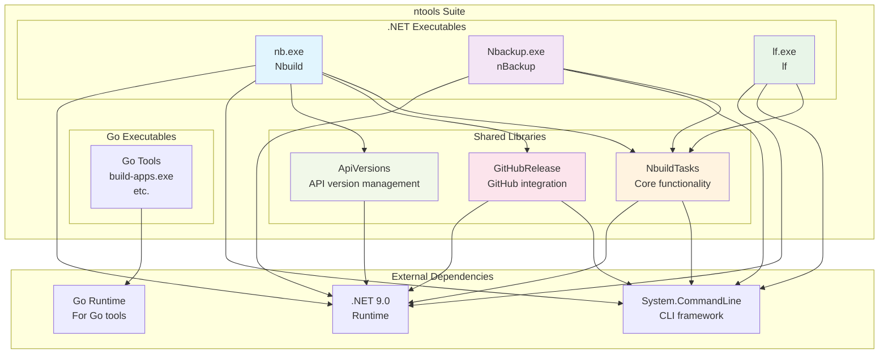

# DevOps Tools Suite Architecture

This document provides a comprehensive overview of the DevOps Tools Suite architecture, encompassing both the .NET-based ntools suite and the Python-based SDO (Simple DevOps Operations Tool). Together, these tools provide a complete DevOps workflow from build automation to work item management across multiple platforms.

## Suite Overview

The DevOps Tools Suite consists of two main components:

### 1. ntools Suite (.NET-based)
A collection of build automation and utility tools written in .NET 9.0, providing core development and DevOps capabilities.

### 2. SDO (Simple DevOps Operations Tool) (Python-based)
A comprehensive CLI tool for work item creation and repository management across Azure DevOps and GitHub platforms.

## ntools Suite Architecture

### Executables Overview

The ntools suite consists of multiple executables that provide various development and DevOps utilities:

- **nb.exe** - Main build automation and DevOps utility tool
- **Nbackup.exe** - Backup automation tool
- **lf.exe** - File listing and management utility
- **Go executables** - Various Go-based utilities in the `go/` directory

### Architecture Diagram



### Executable Details

#### nb.exe (Nbuild)
- **Purpose**: Main CLI tool for build automation and DevOps operations
- **Features**:
  - MSBuild integration
  - Git operations (tagging, branching)
  - GitHub release management
  - Tool installation/uninstallation
  - Environment setup
- **Dependencies**: NbuildTasks, GitHubRelease, System.CommandLine

#### Nbackup.exe (nBackup)
- **Purpose**: Backup automation utility
- **Features**:
  - Automated backup operations
  - Configuration-based backups
- **Dependencies**: NbuildTasks, CommandLine.Net

#### lf.exe (lf)
- **Purpose**: File listing and management utility
- **Features**:
  - Advanced file listing
  - File operations
- **Dependencies**: NbuildTasks, System.CommandLine

#### Go Executables
- **Purpose**: Various utilities written in Go
- **Location**: `go/` directory
- **Examples**: build-apps.exe for building applications

### Shared Components

#### NbuildTasks
Core library providing:
- Git operations
- File system utilities
- Build task implementations
- Common functionality for all executables

#### GitHubRelease
Library for GitHub integration:
- Release creation and management
- Asset uploading
- Repository operations

#### ApiVersions
Utility library for API version management and tracking.

### Build System

All .NET executables are built using:
- .NET 9.0 SDK
- MSBuild
- Custom build targets (nbuild.targets)
- Shared build tasks (NbuildTasks)

Go executables are built using the Go toolchain and custom build scripts.

---

## SDO Architecture

### Overview

SDO (Simple DevOps Operations Tool) is a command-line interface tool designed to streamline work item creation and repository management across multiple DevOps platforms including Azure DevOps and GitHub. The tool follows a modular, extensible architecture that allows for easy addition of new platforms and operations.

### File Structure

```
atools/
├── sdo.py                          # Main entry point and CLI framework
├── sdo_package/                    # Main package directory
│   ├── __init__.py                 # Package initialization
│   ├── cli.py                      # CLI command implementations
│   ├── client.py                   # Azure DevOps REST API client
│   ├── exceptions.py               # Custom exception classes
│   ├── pull_requests.py            # Pull request operations (multi-platform)
│   ├── pipelines.py                # Pipeline operations (multi-platform)
│   ├── repositories.py             # Repository operations (multi-platform)
│   ├── version.py                  # Version information
│   ├── work_items.py               # Work item orchestration logic
│   ├── parsers/                    # Content parsing modules
│   │   ├── __init__.py
│   │   ├── markdown_parser.py      # Markdown file parsing
│   │   └── metadata_parser.py      # Metadata extraction and platform detection
│   └── platforms/                  # Platform-specific implementations
│       ├── __init__.py
│       ├── base.py                 # Abstract base classes for platforms
│       ├── pr_base.py              # Abstract base class for PR platforms
│       ├── azdo_platform.py        # Azure DevOps work item operations
│       ├── azdo_pr_platform.py     # Azure DevOps pull request operations
│       ├── azdo_pipeline_platform.py # Azure DevOps pipeline operations
│       ├── github_platform.py      # GitHub work item operations
│       └── github_pr_platform.py   # GitHub pull request operations
├── tests/                          # Test suite
│   ├── run_sdo_tests.py            # Test runner script
│   ├── test_azdo_platform.py       # Azure DevOps platform tests
│   ├── test_client.py              # Client module tests
│   ├── test_cli_comprehensive.py   # Comprehensive CLI tests
│   ├── test_github_platform.py     # GitHub platform tests
│   ├── test_markdown_parser.py     # Markdown parser tests
│   ├── test_pull_requests.py       # Pull request operations tests
│   ├── test_pipelines.py           # Pipeline operations tests
│   ├── test_repositories.py        # Repository operations tests
│   ├── test_sdo.py                 # Main module tests
│   ├── test_sdo_cli.py             # CLI integration tests
│   ├── test_sdo_workitems.py       # Work item tests
│   └── test_sdo_pipelines.py       # Pipeline tests
├── pyproject.toml                  # Python project configuration
├── requirements.txt                # Production dependencies
├── requirements-dev.txt            # Development dependencies
├── issue-azdo-example.md           # Azure DevOps issue template
├── issue-gh-example.md             # GitHub issue template
└── install-sdo.py                  # Installation script
```

### Architecture Principles

#### 1. **Separation of Concerns**
- **CLI Layer**: User interaction and command handling
- **Business Logic**: Work item orchestration and validation
- **Platform Layer**: Platform-specific implementations
- **Parser Layer**: Content extraction and metadata processing
- **Client Layer**: API communication and authentication

#### 2. **Strategy Pattern**
- Abstract platform interface allows seamless switching between DevOps platforms
- Platform-specific implementations handle unique API requirements
- Consistent interface across all supported platforms

#### 3. **Extensibility**
- Plugin-style architecture for adding new platforms
- Modular parser system for different content formats
- Configurable metadata extraction

### System Architecture

SDO uses a **domain-driven architecture** with separate platform abstractions for each business domain. Each domain (work items, repositories, pipelines, pull requests) has its own business logic module and platform interface because the operations are fundamentally different between Azure DevOps and GitHub.

```
┌─────────────────────────────────────────────────────────────────┐
│                         SDO CLI Tool                            │
├─────────────────────────────────────────────────────────────────┤
│  sdo.py (Main Entry Point)                                      │
│  ├── Click CLI Framework                                        │
│  ├── Command Registration                                       │
│  └── Global Configuration                                       │
└─────────────────────────────────────────────────────────────────┘
                                    │
                                    ▼
┌─────────────────────────────────────────────────────────────────┐
│                    CLI Layer (cli.py)                           │
├─────────────────────────────────────────────────────────────────┤
│  ├── workitem group: create, list, show, update, comment        │
│  ├── repo group: create, show, ls, delete                       │
│  ├── pr group: create, show, status, ls, update                 │
│  ├── pipeline group: create, show, ls, run, status, logs        │
│  ├── Command argument parsing and validation                    │
│  ├── Verbose output management                                  │
│  └── Error handling and user feedback                           │
└─────────────────────────────────────────────────────────────────┘
                                    │
                                    ▼
┌─────────────────────────────────────────────────────────────────┐
│                 Business Logic Layer                            │
├─────────────────────────────────────────────────────────────────┤
│  ├── work_items.py: Work item orchestration                     │
│  ├── repositories.py: Repository operations                     │
│  ├── pull_requests.py: PR operations                            │
│  └── pipelines.py: Pipeline operations                          │
│                                                                 │
│  Each module:                                                   │
│  ├── Platform detection and selection                           │
│  ├── Content processing workflow coordination                   │
│  ├── Result validation and reporting                            │
│  └── Error handling and user feedback                           │
└─────────────────────────────────────────────────────────────────┘
                                    │
                    ┌───────────────┼───────────────┐
                    │               │               │
                    ▼               ▼               ▼
    ┌─────────────────────┐ ┌─────────────────┐ ┌─────────────────┐
    │   Parser Layer      │ │ Platform Layer  │ │  Client Layer   │
    │   (parsers/)        │ │ (platforms/)    │ │   (client.py)   │
    │                     │ │                 │ │                 │
    │  Content parsing:   │ │ Domain-specific │ │ Low-level API:  │
    │  ├── Markdown files │ │ abstractions:   │ │ ├── HTTP client │
    │  ├── Metadata       │ │ ├── Work items  │ │ ├── Auth        │
    │  └── Validation     │ │ ├── Repos       │ │ ├── Platform    │
    │                     │ │ ├── Pipelines   │ │ │   detection   │
    │                     │ │ └── PRs         │ │ └── Logging     │
    └─────────────────────┘ └─────────────────┘ └─────────────────┘
```

### Key Components

#### CLI Layer (cli.py)
Provides hierarchical command structure:
- **workitem**: create, list, show, update, comment
- **repo**: create, show, ls, delete
- **pr**: create, show, status, ls, update
- **pipeline**: create, show, ls, run, status, logs, lastbuild, update, delete

#### Business Logic Layer
Core orchestration modules for each domain:
- **work_items.py**: Work item creation and management
- **repositories.py**: Repository operations
- **pull_requests.py**: PR operations
- **pipelines.py**: Pipeline operations

#### Platform Layer (platforms/)
Abstract interfaces with platform-specific implementations:
- **Azure DevOps**: REST API integration
- **GitHub**: CLI-based operations
- Separate abstractions for work items, repos, PRs, and pipelines

### Dependencies

#### Core Dependencies
- `click>=8.0.0`: CLI framework
- `requests>=2.25.0`: HTTP client for Azure DevOps
- `pyyaml>=6.0.0`: YAML parsing

#### Development Dependencies
- `pytest`: Testing framework
- `black`: Code formatting
- `mypy`: Static type checking
- `coverage`: Test coverage analysis

## Integration Points

### Cross-Tool Workflows
1. **Build → Work Item Creation**: ntools builds can trigger SDO work item creation
2. **Repository Management**: SDO can create repos that ntools can then build in
3. **Pipeline Integration**: SDO pipeline operations complement ntools build automation

### Shared Concepts
- Both tools support Azure DevOps and GitHub integration
- Common authentication patterns (PATs, CLI auth)
- Similar CLI design principles
- Cross-platform compatibility

## Future Considerations

### Unified CLI Experience
Potential future enhancements could include:
- Unified authentication management
- Cross-tool command chaining
- Shared configuration system
- Integrated help and discovery

This combined architecture document provides a comprehensive view of both tool suites, enabling better understanding of the complete DevOps toolchain and potential integration opportunities.</content>
<parameter name="filePath">c:\source\ntools\docs\devops-tools-suite-architecture.md