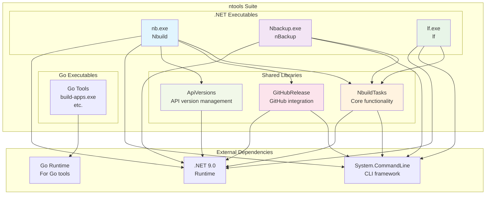
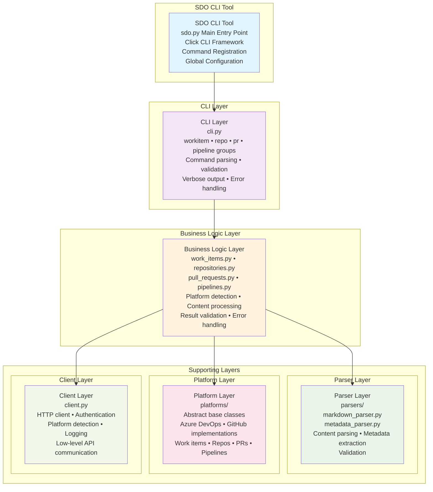

# DevOps Tools Suite Architecture

This document provides a comprehensive overview of the DevOps Tools Suite architecture, encompassing both the .NET-based ntools suite and the Python-based SDO (Simple DevOps Operations Tool). Together, these tools provide a complete DevOps workflow from build automation to work item management across multiple platforms.

## Suite Overview

The DevOps Tools Suite consists of two main components:

### 1. ntools Suite (.NET-based)
A collection of build automation and utility tools written in .NET 9.0, providing core development and DevOps capabilities.

### 2. SDO (Simple DevOps Operations Tool) (Python-based)
A comprehensive CLI tool for work item creation and repository management across Azure DevOps and GitHub platforms.

## ntools Suite Architecture

### Executables Overview

The ntools suite consists of multiple executables that provide various development and DevOps utilities:

- **nb.exe** - Main build automation and DevOps utility tool
- **Nbackup.exe** - Backup automation tool
- **lf.exe** - File listing and management utility
- **Go executables** - Various Go-based utilities in the `go/` directory

### Architecture Diagram



### Executable Details

#### nb.exe (Nbuild)
- **Purpose**: Main CLI tool for build automation and DevOps operations
- **Features**:
  - MSBuild integration
  - Git operations (tagging, branching)
  - GitHub release management
  - Tool installation/uninstallation
  - Environment setup
- **Dependencies**: NbuildTasks, GitHubRelease, System.CommandLine

#### Nbackup.exe (nBackup)
- **Purpose**: Backup automation utility
- **Features**: Automated backup operations, configuration-based backups
- **Dependencies**: NbuildTasks, System.CommandLine

#### lf.exe (lf)
- **Purpose**: File listing and management utility
- **Features**: Advanced file listing, file operations
- **Dependencies**: NbuildTasks, System.CommandLine

#### Go Executables
- **Purpose**: Various utilities written in Go
- **Location**: `go/` directory
- **Examples**: build-apps.exe for building applications

### Shared Components

#### NbuildTasks
Core library providing Git operations, file system utilities, build task implementations, and common functionality for all executables.

#### GitHubRelease
Library for GitHub integration including release creation and management, asset uploading, and repository operations.

#### ApiVersions
Utility library for API version management and tracking.

### File Structure

```
ntools/
├── ntools.sln                    # Main solution file
├── Nbuild.bat                    # Build script
├── prebuild.bat                  # Pre-build setup script
├── mkdocs.yml                    # Documentation configuration
├── pyproject.toml                # Python project configuration (for docs)
├── docs-requirements.txt         # Documentation dependencies
├── CHANGELOG.md                  # Change log
├── README.md                     # Project documentation
├── targets.md                    # Build targets documentation
├── coverage.cobertura.xml        # Test coverage report
├── nbuild.targets                # MSBuild targets
├── unit-tests.targets            # Unit test targets
├── e2e-tests.targets             # E2E test targets
│
├── Nbuild/                       # Main Nbuild executable project
│   ├── Nbuild.csproj
│   ├── Program.cs
│   └── Commands/                 # CLI command implementations
│
├── NbuildTasks/                  # Shared library
│   ├── NbuildTasks.csproj
│   ├── GitTasks.cs               # Git operations
│   ├── FileTasks.cs              # File system utilities
│   ├── BuildTasks.cs             # Build task implementations
│   └── Common/                   # Shared utilities
│
├── GitHubRelease/                # GitHub integration library
│   ├── GitHubRelease.csproj
│   ├── ReleaseManager.cs         # Release management
│   ├── AssetUploader.cs          # Asset upload functionality
│   └── RepositoryOps.cs          # Repository operations
│
├── ApiVersions/                  # API version management
│   ├── ApiVersions.csproj
│   ├── VersionManager.cs         # Version tracking
│   └── ApiClient.cs              # API client utilities
│
├── Nbackup/                      # Backup tool
│   ├── Nbackup.csproj
│   ├── Program.cs
│   └── BackupEngine.cs           # Backup logic
│
├── lf/                           # File listing utility
│   ├── lf.csproj
│   ├── Program.cs
│   └── FileLister.cs             # File listing implementation
│
├── go/                           # Go-based utilities
│   ├── build-apps/               # Application builder
│   ├── other-tools/              # Additional Go tools
│   └── build-scripts/            # Go build scripts
│
├── GitHubReleaseTests/           # Unit tests for GitHubRelease
│   ├── GitHubReleaseTests.csproj
│   └── ReleaseTests.cs
│
├── lfTests/                      # Unit tests for lf
│   ├── lfTests.csproj
│   └── FileListerTests.cs
│
├── nBackupTests/                 # Unit tests for Nbackup
│   ├── nBackupTests.csproj
│   └── BackupTests.cs
│
├── docs/                         # Documentation
│   ├── index.md
│   ├── devops-tools-suite-architecture.md
│   └── other-docs/
│
├── dev-setup/                    # Development setup scripts
├── Debug/                        # Debug build outputs
├── ArtifactsFolder/              # Build artifacts
├── logs/                         # Build and test logs
└── atools/                       # Additional tools
```

### Build System

All .NET executables are built using:
- .NET 9.0 SDK
- MSBuild
- Custom build targets (nbuild.targets)
- Shared build tasks (NbuildTasks)

Go executables are built using the Go toolchain and custom build scripts.

---

## SDO Architecture

### Overview

SDO (Simple DevOps Operations Tool) is a command-line interface tool for work item creation and repository management across Azure DevOps and GitHub platforms, following a modular, extensible architecture.

### File Structure

```
atools/
├── sdo.py                          # Main entry point and CLI framework
├── sdo_package/                    # Main package directory
│   ├── __init__.py                 # Package initialization
│   ├── cli.py                      # CLI command implementations
│   ├── client.py                   # Azure DevOps REST API client
│   ├── exceptions.py               # Custom exception classes
│   ├── pull_requests.py            # Pull request operations (multi-platform)
│   ├── pipelines.py                # Pipeline operations (multi-platform)
│   ├── repositories.py             # Repository operations (multi-platform)
│   ├── version.py                  # Version information
│   ├── work_items.py               # Work item orchestration logic
│   ├── parsers/                    # Content parsing modules
│   │   ├── __init__.py
│   │   ├── markdown_parser.py      # Markdown file parsing
│   │   └── metadata_parser.py      # Metadata extraction and platform detection
│   └── platforms/                  # Platform-specific implementations
│       ├── __init__.py
│       ├── base.py                 # Abstract base classes for platforms
│       ├── pr_base.py              # Abstract base class for PR platforms
│       ├── azdo_platform.py        # Azure DevOps work item operations
│       ├── azdo_pr_platform.py     # Azure DevOps pull request operations
│       ├── azdo_pipeline_platform.py # Azure DevOps pipeline operations
│       ├── github_platform.py      # GitHub work item operations
│       └── github_pr_platform.py   # GitHub pull request operations
├── tests/                          # Test suite
│   ├── run_sdo_tests.py            # Test runner script
│   ├── test_azdo_platform.py       # Azure DevOps platform tests
│   ├── test_client.py              # Client module tests
│   ├── test_cli_comprehensive.py   # Comprehensive CLI tests
│   ├── test_github_platform.py     # GitHub platform tests
│   ├── test_markdown_parser.py     # Markdown parser tests
│   ├── test_pull_requests.py       # Pull request operations tests
│   ├── test_pipelines.py           # Pipeline operations tests
│   ├── test_repositories.py        # Repository operations tests
│   ├── test_sdo.py                 # Main module tests
│   ├── test_sdo_cli.py             # CLI integration tests
│   ├── test_sdo_workitems.py       # Work item tests
│   └── test_sdo_pipelines.py       # Pipeline tests
├── pyproject.toml                  # Python project configuration
├── requirements.txt                # Production dependencies
├── requirements-dev.txt            # Development dependencies
├── issue-azdo-example.md           # Azure DevOps issue template
├── issue-gh-example.md             # GitHub issue template
└── install-sdo.py                  # Installation script
```

### Architecture Principles

Both tool suites follow consistent design principles:

#### 1. **Separation of Concerns**
- **CLI Layer**: User interaction and command handling
- **Business Logic**: Domain-specific orchestration and validation
- **Platform Layer**: Platform-specific implementations with abstract interfaces
- **Parser Layer**: Content extraction and metadata processing
- **Client Layer**: API communication and authentication

#### 2. **Strategy Pattern**
- Abstract platform interfaces enable seamless switching between DevOps platforms
- Platform-specific implementations handle unique API requirements
- Consistent interfaces across all supported platforms

#### 3. **Extensibility**
- Plugin-style architecture for adding new platforms
- Modular parser systems for different content formats
- Configurable metadata extraction and processing

### System Architecture

SDO uses a domain-driven architecture with separate platform abstractions for each business domain (work items, repositories, pipelines, pull requests), where each domain has its own business logic module and platform interface.



### Key Components

#### CLI Layer (cli.py)
Provides hierarchical command structure for workitem, repo, pr, and pipeline operations with command parsing, validation, and error handling.

#### Business Logic Layer
Core orchestration modules: work_items.py, repositories.py, pull_requests.py, and pipelines.py for domain-specific operations.

#### Platform Layer (platforms/)
Abstract interfaces with platform-specific implementations for Azure DevOps (REST API) and GitHub (CLI-based) across work items, repos, PRs, and pipelines.

### Dependencies

#### ntools Suite (.NET)
- **Runtime**: .NET 9.0 SDK, Go runtime
- **CLI Framework**: System.CommandLine
- **Build System**: MSBuild with custom targets

#### SDO Tool (Python)
- **Core**: `click>=8.0.0` (CLI framework), `requests>=2.25.0` (HTTP client), `pyyaml>=6.0.0` (YAML parsing)
- **Development**: `pytest`, `black`, `mypy`, `coverage`

## Integration Points

### Cross-Tool Workflows
1. **Build → Work Item Creation**: ntools builds can trigger SDO work item creation
2. **Repository Management**: SDO can create repos that ntools can then build in
3. **Pipeline Integration**: SDO pipeline operations complement ntools build automation

### Shared Concepts
- Dual platform support (Azure DevOps and GitHub)
- Common authentication patterns
- Consistent CLI design principles
- Cross-platform compatibility

This combined architecture document provides a comprehensive view of both tool suites, enabling better understanding of the complete DevOps toolchain and potential integration opportunities.