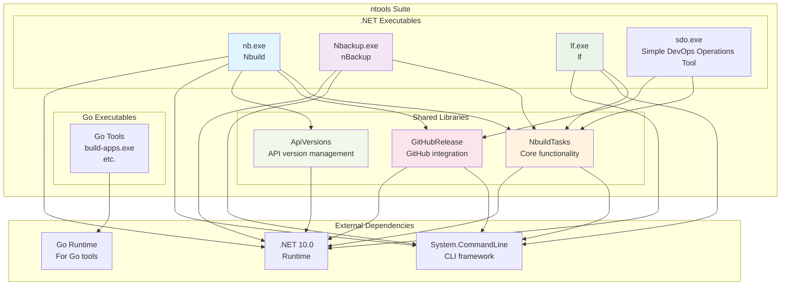

# DevOps Tools Suite Architecture

This document provides a comprehensive overview of the DevOps Tools Suite architecture, encompassing the .NET-based ntools suite including sdo (C# implementation of Simple DevOps Operations Tool). These tools provide a complete DevOps workflow from build automation to work item management across multiple platforms.

## Suite Overview

The DevOps Tools Suite consists of two main components:

### 1. ntools Suite (.NET-based)
A collection of build automation and utility tools written in .NET 10.0, providing core development and DevOps capabilities.

### 2. sdo (Simple DevOps Operations Tool) - .NET/C#
A comprehensive CLI tool for work item creation and repository management across Azure DevOps and GitHub platforms, written entirely in C# for maximum performance and .NET ecosystem integration.

## ntools Suite Architecture

### Executables Overview

The ntools suite consists of multiple executables that provide various development and DevOps utilities:

- **nb.exe** - Main build automation and DevOps utility tool
- **Nbackup.exe** - Backup automation tool
- **lf.exe** - File listing and management utility
- **sdo.exe** - Simple DevOps Operations tool for work item and repository management
- **Go executables** - Various Go-based utilities in the `go/` directory

### Architecture Diagram


```mermaid
graph TB
    subgraph "ntools Suite"
        subgraph ".NET Executables"
            NB[nb.exe<br/>Nbuild]
            NBKP[Nbackup.exe<br/>nBackup]
            LF[lf.exe<br/>lf]
            SDO[sdo.exe<br/>Simple DevOps Operations Tool]
        end

        subgraph "Go Executables"
            GO[Go Tools<br/>build-apps.exe<br/>etc.]
        end

        subgraph "Shared Libraries"
            NBL[NbuildTasks<br/>Core functionality]
            GHR[GitHubRelease<br/>GitHub integration]
            API[ApiVersions<br/>API version management]
        end
    end

    subgraph "External Dependencies"
        SCL[System.CommandLine<br/>CLI framework]
        DOTNET[.NET 10.0<br/>Runtime]
        GO_RUNTIME[Go Runtime<br/>For Go tools]
    end

    NB --> NBL
    NBKP --> NBL
    LF --> NBL

    NB --> GHR
    NB --> API

    GO --> GO_RUNTIME

    NBL --> SCL
    GHR --> SCL
    NB --> SCL
    NBKP --> SCL
    LF --> SCL

    NB --> DOTNET
    NBKP --> DOTNET
    LF --> DOTNET
    NBL --> DOTNET
    GHR --> DOTNET
    API --> DOTNET
    SDO --> NBL
    SDO --> GHR
    style NB fill:#e1f5fe
    style NBKP fill:#f3e5f5
    style LF fill:#e8f5e8
    style NBL fill:#fff3e0
    style GHR fill:#fce4ec
    style API fill:#f1f8e9  
```

### Executable Details

#### nb.exe (Nbuild)
- **Purpose**: Main CLI tool for build automation and DevOps operations
- **Features**:
  - MSBuild integration
  - Git operations (tagging, branching)
  - GitHub release management
  - Tool installation/uninstallation
  - Environment setup
- **Dependencies**: NbuildTasks, GitHubRelease, System.CommandLine

#### Nbackup.exe (nBackup)
- **Purpose**: Backup automation utility
- **Features**: Automated backup operations, configuration-based backups
- **Dependencies**: NbuildTasks, System.CommandLine

#### lf.exe (lf)
- **Purpose**: File listing and management utility
- **Features**: Advanced file listing, file operations
- **Dependencies**: NbuildTasks, System.CommandLine
#### sdo.exe (Simple DevOps Operations Tool)
- **Purpose**: Comprehensive CLI for work item creation and repository management across Azure DevOps and GitHub
- **Features**:
  - Work item management (create, list, show, update, comment)
  - Repository operations (create, list, delete)
  - Pull request management (create, list, show, update)
  - Pipeline management (create, run, monitor)
  - Dry-run mode for previewing operations
  - **Advanced Automation Features** (new):
    - YAML configuration system with auto-discovery
    - Markdown parser for rich content creation
    - E2E testing infrastructure with cross-platform support
#### Go Executables
- **Purpose**: Various utilities written in Go
- **Location**: `go/` directory
- **Examples**: build-apps.exe for building applications

### Shared Components

#### NbuildTasks
Core library providing Git operations, file system utilities, build task implementations, and common functionality for all executables.

#### GitHubRelease
Library for GitHub integration including release creation and management, asset uploading, and repository operations.

#### ApiVersions
Utility library for API version management and tracking.

### File Structure

```
ntools/
├── ntools.sln                    # Main solution file
├── prebuild.bat                  # Pre-build setup script
├── mkdocs.yml                    # Documentation configuration

├── CHANGELOG.md                  # Change log
├── README.md                     # Project documentation
├── targets.md                    # Build targets documentation
├── coverage.cobertura.xml        # Test coverage report
├── nbuild.targets                # MSBuild targets
├── unit-tests.targets            # Unit test targets
├── e2e-tests.targets             # E2E test targets
│
├── Nbuild/                       # Main Nbuild executable project
│   ├── Nbuild.csproj
│   ├── Program.cs
│   └── Commands/                 # CLI command implementations
│
├── NbuildTasks/                  # Shared library
│   ├── NbuildTasks.csproj
│   ├── GitTasks.cs               # Git operations
│   ├── FileTasks.cs              # File system utilities
│   ├── BuildTasks.cs             # Build task implementations
│   └── Common/                   # Shared utilities
│
├── GitHubRelease/                # GitHub integration library
│   ├── GitHubRelease.csproj
│   ├── ReleaseManager.cs         # Release management
│   ├── AssetUploader.cs          # Asset upload functionality
│   └── RepositoryOps.cs          # Repository operations
│
├── ApiVersions/                  # API version management
│   ├── ApiVersions.csproj
│   ├── VersionManager.cs         # Version tracking
│   └── ApiClient.cs              # API client utilities
│
├── Nbackup/                      # Backup tool
│   ├── Nbackup.csproj
│   ├── Program.cs
│   └── BackupEngine.cs           # Backup logic
│
├── lf/                           # File listing utility
│   ├── lf.csproj
│   ├── Program.cs
│   └── FileLister.cs             # File listing implementation
│
├── go/                           # Go-based utilities
│   ├── build-apps/               # Application builder
│   ├── other-tools/              # Additional Go tools
│   └── build-scripts/            # Go build scripts
│
├── GitHubReleaseTests/           # Unit tests for GitHubRelease
│   ├── GitHubReleaseTests.csproj
│   └── ReleaseTests.cs
│
├── lfTests/                      # Unit tests for lf
│   ├── lfTests.csproj
│   └── FileListerTests.cs
│
├── nBackupTests/                 # Unit tests for Nbackup
│   ├── nBackupTests.csproj
│   └── BackupTests.cs
│
├── docs/                         # Documentation
│   ├── index.md
│   ├── devops-tools-suite-architecture.md
│   └── other-docs/
│
├── dev-setup/                    # Development setup scripts
├── Debug/                        # Debug build outputs
├── ArtifactsFolder/              # Build artifacts
├── logs/                         # Build and test logs
├── atools/                       # Automated tools and installers
│   ├── tests/                    # Tests for installation scripts
│   │   └── test_install_ntools.py # Tests for the NTools installer
│   ├── install-ntools.py         # NTools installation script
│   ├── requirements.txt           # Python dependencies for installers
│   └── requirements-dev.txt       # Development dependencies
│
└── Sdo/                          # sdo (C# executable)
    ├── Sdo.csproj                # C# project file
    ├── Program.cs                # Main entry point and CLI setup
    ├── Commands/                 # Command implementations
    │   ├── WorkItemCommand.cs
    │   ├── RepositoryCommand.cs
    │   ├── PullRequestCommand.cs
    │   └── PipelineCommand.cs
    ├── Services/                 # Business logic
    │   ├── WorkItemService.cs
    │   ├── RepositoryService.cs
    │   ├── PullRequestService.cs
    │   └── PipelineService.cs
    ├── Platforms/                # Platform implementations
    │   ├── IPlatform.cs
    │   ├── AzureDevOpsPlatform.cs
    │   └── GitHubPlatform.cs
    ├── Models/                   # Data models
    ├── Credentials/              # Authentication handling
    ├── Helpers/                  # Utility helpers
    └── bin/Debug/sdo.exe         # Compiled executable
```

### Build System

All .NET executables are built using:
- .NET 10.0 SDK
- MSBuild
- Custom build targets (nbuild.targets)
- Shared build tasks (NbuildTasks)

Go executables are built using the Go toolchain and custom build scripts.

---

## sdo (Simple DevOps Operations Tool) - Architecture & Design

### Overview

sdo is a .NET/C# command-line tool for work item creation and repository management across Azure DevOps and GitHub platforms. It provides comprehensive DevOps capabilities with high performance and native .NET ecosystem integration.

### Architecture Principles

Both sdo and ntools Suite follow consistent design principles:

#### 1. **Separation of Concerns**
- **CLI Layer**: User interaction and command handling
- **Business Logic**: Domain-specific orchestration and validation
- **Platform Layer**: Platform-specific implementations with abstract interfaces
- **Service Layer**: High-level business operations

#### 2. **Strategy Pattern**
- Abstract platform interfaces enable seamless switching between DevOps platforms
- Platform-specific implementations handle unique API requirements
- Consistent interfaces across all supported platforms

#### 3. **Extensibility**
- Plugin-style architecture for adding new platforms
- Modular service systems for different business domains
- Configurable authentication and API integration

### Advanced Automation Features

**Advanced Automation Features** introduces comprehensive enterprise capabilities to the SDO CLI tool, enabling teams to standardize operations and ensure reliable cross-platform testing.

#### 1. **YAML Configuration System**
- **ConfigurationManager**: New utility class with YamlDotNet integration
- **Auto-Discovery**: Searches current directory → .temp subfolder → parent directory's .temp folder
- **Nested Structure**: Supports complex nested YAML configurations flattened to dot-notation
- **Configuration Priority** (highest to lowest):
  1. CLI parameters (e.g., `sdo wi list --state "Done"`)
  2. Config file defaults (from sdo-config.yaml)
  3. Hard-coded defaults in code
- **Example**: `sdo wi list --config .\.temp\sdo-config.yaml` applies default filters for area, state, type, iteration, and top
- **Benefits**: Team standardization, reduced repetitive CLI arguments, config file sharing via version control

#### 2. **Markdown Parser**
- **MarkdownParser**: New utility class for parsing markdown content
- **Rich Content Support**: 
  - YAML frontmatter parsing
  - Title and description extraction
  - Metadata extraction (Key: Value format in headers)
  - Acceptance criteria parsing (checkbox-based lists)
  - Code block extraction and preservation
- **Features**:
  - GitHub-flavored markdown (GFM) syntax support
  - HTML sanitization for security
  - Comprehensive error reporting with line numbers
  - Verbose mode for detailed diagnostics
- **Integration**: Automatically applied when creating work items or PRs from markdown files
- **Benefits**: Professional-formatted work items, template reuse, standardized content structure

#### 4. **E2E Testing Infrastructure**
- **e2e-tests.targets**: New MSBuild build targets for E2E test orchestration
- **Test Discovery**: Reflection-based attribute matching for automatic test discovery
- **Color-Coded Output**: 
  - [SUCCESS] messages in green for quick feedback
  - [ERROR] messages in red for failure identification
  - Plain text log file output (sdo-e2e-test.log)
- **Cross-Platform Validation**: Integrated tests for both Azure DevOps and GitHub platforms
- **Test Execution**: Supports specific test case execution via `--test-case` parameter
- **Available Targets**:
  - `RUN_AZDO_WI_ASSIGNED_TO_ME_TEST` - Azure DevOps work item filtering
  - `RUN_GITHUB_WI_ASSIGNED_TO_ME_TEST` - GitHub issue filtering
  - `RUN_AZDO_PIPELINE_TEST` - Azure DevOps pipeline operations
  - `RUN_GITHUB_PIPELINE_TEST` - GitHub Actions operations
- **Benefits**: Automated quality validation, cross-platform parity assurance, comprehensive release testing

#### 5. **Service Enhancements**
- **AzureDevOpsClient**: 
  - Endpoint prioritization: /connectionData first (most reliable), falls back to Graph API
  - Enhanced error handling and logging
  - Improved user detection reliability
- **GitHubClient**: 
  - Enhanced error handling for API operations
  - Improved API timeout management (default 30s, configurable)
  - Better exception messaging for troubleshooting
- **WorkItemCommand**: 
  - Comprehensive error handling for list, show, create operations
  - Config file loading with error validation
  - Better user feedback and validation
- **PullRequestCommand**: 
  - Branch existence validation before creation
  - Improved error messages and diagnostic information
- **Benefits**: Better error handling, improved reliability, enhanced developer experience

### Key Features

- **Multi-Platform Support**: Works seamlessly with Azure DevOps and GitHub
- **Work Item Management**: Create, list, show, update, and comment on work items
- **Repository Operations**: Create, list, delete, and manage repositories
- **Pull Request Management**: Create, list, show, and update pull requests
- **Pipeline Management**: Create, run, monitor, and manage CI/CD pipelines
- **Dry-Run Mode**: Preview operations before execution
- **Automatic Platform Detection**: Detects platform from Git remote configuration
- **Configuration Management**: YAML-based defaults for standardized operations (Advanced Automation Features)
- **Rich Content**: Markdown templates for professional work items and PRs (Advanced Automation Features)
- **Automated Testing**: E2E testing infrastructure with cross-platform validation (Advanced Automation Features)

### Dependencies

#### ntools Suite (.NET)
- **Runtime**: .NET 10.0 SDK
- **CLI Framework**: System.CommandLine 2.0.2
- **Build System**: MSBuild with custom targets

#### sdo (C# Simple DevOps Operations Tool)
- **Runtime**: .NET 10.0 (only supported implementation)
- **CLI Framework**: System.CommandLine 2.0.2
- **Configuration**: YamlDotNet 15.1.1 for YAML parsing (Advanced Automation Features)
- **API Clients**: Octokit.NET (GitHub API), Microsoft.TeamFoundationServer.Client (Azure DevOps API)
- **HTTP**: System.Net.Http for REST calls
- **JSON**: System.Text.Json for JSON processing
- **Development & Testing**: xunit, Moq, Microsoft.NET.Test.Sdk
- **Installation Scripts**: Python (for cross-platform installer compatibility only)

## Integration Points

### Cross-Tool Workflows
1. **Build → Work Item Creation**: ntools builds can trigger sdo C# work item creation
2. **Repository Management**: sdo can create repos that ntools can then build in
3. **Pipeline Integration**: sdo pipeline operations complement ntools build automation
4. **Work Item Tracking**: sdo provides work item management alongside ntools build tracking

### Shared Concepts
- **Dual Platform Support**: Both tools work seamlessly with Azure DevOps and GitHub
- **Common Authentication Patterns**: Shared credential management across ntools and sdo
- **Consistent CLI Design**: System.CommandLine framework for both tool suites
- **Cross-Platform Compatibility**: All executables run on Windows, Linux, and macOS
- **Performance First**: C# implementation ensures fast, reliable DevOps operations
