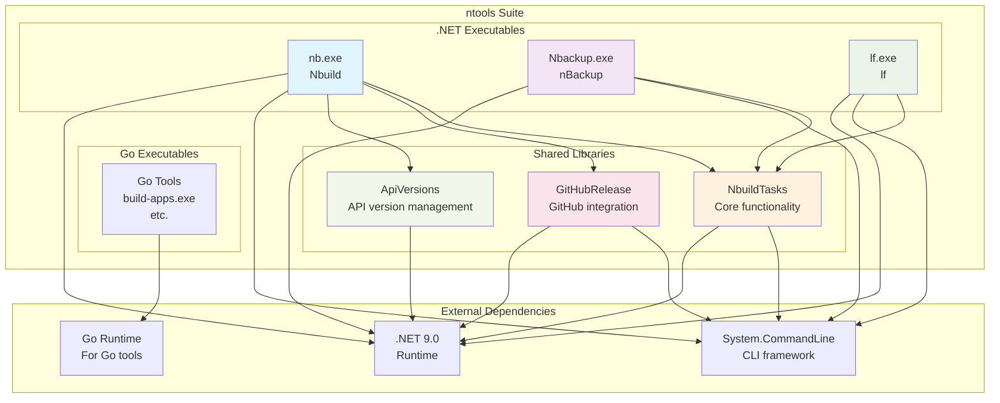

# DevOps Tools Suite Architecture

This document provides a comprehensive overview of the DevOps Tools Suite architecture, encompassing the .NET-based ntools suite including sdo.net (C# implementation of Simple DevOps Operations Tool). These tools provide a complete DevOps workflow from build automation to work item management across multiple platforms.

## Suite Overview

The DevOps Tools Suite consists of two main components:

### 1. ntools Suite (.NET-based)
A collection of build automation and utility tools written in .NET 10.0, providing core development and DevOps capabilities.

### 2. sdo.net (Simple DevOps Operations Tool) (.NET/C#-based)
A comprehensive CLI tool for work item creation and repository management across Azure DevOps and GitHub platforms. This is the modern C# implementation with full feature parity and 2x+ performance improvement over the deprecated Python version.

## ntools Suite Architecture

### Executables Overview

The ntools suite consists of multiple executables that provide various development and DevOps utilities:

- **nb.exe** - Main build automation and DevOps utility tool
- **Nbackup.exe** - Backup automation tool
- **lf.exe** - File listing and management utility
- **Go executables** - Various Go-based utilities in the `go/` directory

### Architecture Diagram


```mermaid
graph TB
    subgraph "ntools Suite"
        subgraph ".NET Executables"
            NB[nb.exe<br/>Nbuild]
            NBKP[Nbackup.exe<br/>nBackup]
            LF[lf.exe<br/>lf]
        end

        subgraph "Go Executables"
            GO[Go Tools<br/>build-apps.exe<br/>etc.]
        end

        subgraph "Shared Libraries"
            NBL[NbuildTasks<br/>Core functionality]
            GHR[GitHubRelease<br/>GitHub integration]
            API[ApiVersions<br/>API version management]
        end
    end

    subgraph "External Dependencies"
        SCL[System.CommandLine<br/>CLI framework]
        DOTNET[.NET 9.0<br/>Runtime]
        GO_RUNTIME[Go Runtime<br/>For Go tools]
    end

    NB --> NBL
    NBKP --> NBL
    LF --> NBL

    NB --> GHR
    NB --> API

    GO --> GO_RUNTIME

    NBL --> SCL
    GHR --> SCL
    NB --> SCL
    NBKP --> SCL
    LF --> SCL

    NB --> DOTNET
    NBKP --> DOTNET
    LF --> DOTNET
    NBL --> DOTNET
    GHR --> DOTNET
    API --> DOTNET

    style NB fill:#e1f5fe
    style NBKP fill:#f3e5f5
    style LF fill:#e8f5e8
    style NBL fill:#fff3e0
    style GHR fill:#fce4ec
    style API fill:#f1f8e9
```

### Executable Details

#### nb.exe (Nbuild)
- **Purpose**: Main CLI tool for build automation and DevOps operations
- **Features**:
  - MSBuild integration
  - Git operations (tagging, branching)
  - GitHub release management
  - Tool installation/uninstallation
  - Environment setup
- **Dependencies**: NbuildTasks, GitHubRelease, System.CommandLine

#### Nbackup.exe (nBackup)
- **Purpose**: Backup automation utility
- **Features**: Automated backup operations, configuration-based backups
- **Dependencies**: NbuildTasks, System.CommandLine

#### lf.exe (lf)
- **Purpose**: File listing and management utility
- **Features**: Advanced file listing, file operations
- **Dependencies**: NbuildTasks, System.CommandLine

#### Go Executables
- **Purpose**: Various utilities written in Go
- **Location**: `go/` directory
- **Examples**: build-apps.exe for building applications

### Shared Components

#### NbuildTasks
Core library providing Git operations, file system utilities, build task implementations, and common functionality for all executables.

#### GitHubRelease
Library for GitHub integration including release creation and management, asset uploading, and repository operations.

#### ApiVersions
Utility library for API version management and tracking.

### File Structure

```
ntools/
├── ntools.sln                    # Main solution file
├── prebuild.bat                  # Pre-build setup script
├── mkdocs.yml                    # Documentation configuration
├── pyproject.toml                # Python project configuration (for docs)
├── docs-requirements.txt         # Documentation dependencies
├── CHANGELOG.md                  # Change log
├── README.md                     # Project documentation
├── targets.md                    # Build targets documentation
├── coverage.cobertura.xml        # Test coverage report
├── nbuild.targets                # MSBuild targets
├── unit-tests.targets            # Unit test targets
├── e2e-tests.targets             # E2E test targets
│
├── Nbuild/                       # Main Nbuild executable project
│   ├── Nbuild.csproj
│   ├── Program.cs
│   └── Commands/                 # CLI command implementations
│
├── NbuildTasks/                  # Shared library
│   ├── NbuildTasks.csproj
│   ├── GitTasks.cs               # Git operations
│   ├── FileTasks.cs              # File system utilities
│   ├── BuildTasks.cs             # Build task implementations
│   └── Common/                   # Shared utilities
│
├── GitHubRelease/                # GitHub integration library
│   ├── GitHubRelease.csproj
│   ├── ReleaseManager.cs         # Release management
│   ├── AssetUploader.cs          # Asset upload functionality
│   └── RepositoryOps.cs          # Repository operations
│
├── ApiVersions/                  # API version management
│   ├── ApiVersions.csproj
│   ├── VersionManager.cs         # Version tracking
│   └── ApiClient.cs              # API client utilities
│
├── Nbackup/                      # Backup tool
│   ├── Nbackup.csproj
│   ├── Program.cs
│   └── BackupEngine.cs           # Backup logic
│
├── lf/                           # File listing utility
│   ├── lf.csproj
│   ├── Program.cs
│   └── FileLister.cs             # File listing implementation
│
├── go/                           # Go-based utilities
│   ├── build-apps/               # Application builder
│   ├── other-tools/              # Additional Go tools
│   └── build-scripts/            # Go build scripts
│
├── GitHubReleaseTests/           # Unit tests for GitHubRelease
│   ├── GitHubReleaseTests.csproj
│   └── ReleaseTests.cs
│
├── lfTests/                      # Unit tests for lf
│   ├── lfTests.csproj
│   └── FileListerTests.cs
│
├── nBackupTests/                 # Unit tests for Nbackup
│   ├── nBackupTests.csproj
│   └── BackupTests.cs
│
├── docs/                         # Documentation
│   ├── index.md
│   ├── devops-tools-suite-architecture.md
│   └── other-docs/
│
├── dev-setup/                    # Development setup scripts
├── Debug/                        # Debug build outputs
├── ArtifactsFolder/              # Build artifacts
├── logs/                         # Build and test logs
└── atools/                       # Additional tools
```

### Build System

All .NET executables are built using:
- .NET 9.0 SDK
- MSBuild
- Custom build targets (nbuild.targets)
- Shared build tasks (NbuildTasks)

Go executables are built using the Go toolchain and custom build scripts.

---

## sdo.net (C#) Architecture

### Overview

sdo.net (Simple DevOps Operations Tool) is a modern .NET/C# command-line tool for work item creation and repository management across Azure DevOps and GitHub platforms. It provides full feature parity with the deprecated Python version while delivering 2x+ performance improvement.

### File Structure

```
Sdo/
├── Sdo.csproj                      # C# project file
├── Program.cs                      # Main entry point
├── Cli/                            # CLI command implementations
├── Services/                       # Business logic services
│   ├── WorkItemService.cs
│   ├── RepositoryService.cs
│   ├── PullRequestService.cs
│   └── PipelineService.cs
├── Platforms/                      # Platform-specific implementations
│   ├── IPlatform.cs               # Platform interface
│   ├── AzureDevOpsPlatform.cs     # Azure DevOps operations
│   └── GitHubPlatform.cs          # GitHub operations
├── Models/                         # Data models
├── Tests/                          # Unit and integration tests
└── mapping.md                      # Command mappings reference
```

### Architecture Principles

Both sdo.net and ntools Suite follow consistent design principles:

#### 1. **Separation of Concerns**
- **CLI Layer**: User interaction and command handling
- **Business Logic**: Domain-specific orchestration and validation
- **Platform Layer**: Platform-specific implementations with abstract interfaces
- **Service Layer**: High-level business operations

#### 2. **Strategy Pattern**
- Abstract platform interfaces enable seamless switching between DevOps platforms
- Platform-specific implementations handle unique API requirements
- Consistent interfaces across all supported platforms

#### 3. **Extensibility**
- Plugin-style architecture for adding new platforms
- Modular service systems for different business domains
- Configurable authentication and API integration

### Key Features

- **Multi-Platform Support**: Works seamlessly with Azure DevOps and GitHub
- **Work Item Management**: Create, list, show, update, and comment on work items
- **Repository Operations**: Create, list, delete, and manage repositories
- **Pull Request Management**: Create, list, show, and update pull requests
- **Pipeline Management**: Create, run, monitor, and manage CI/CD pipelines
- **Dry-Run Mode**: Preview operations before execution
- **Automatic Platform Detection**: Detects platform from Git remote configuration

### Dependencies

#### ntools Suite (.NET)
- **Runtime**: .NET 10.0 SDK
- **CLI Framework**: System.CommandLine 2.0.1
- **Build System**: MSBuild with custom targets

#### sdo.net (C# Simple DevOps Operations Tool)
- **Runtime**: .NET 10.0
- **CLI Framework**: System.CommandLine
- **API Clients**: Octokit.NET (GitHub API), Microsoft.TeamFoundationServer.Client (Azure DevOps API)
- **HTTP**: System.Net.Http for REST calls
- **JSON**: System.Text.Json for JSON processing
- **Development**: xunit, Moq, Microsoft.NET.Test.Sdk

## Integration Points

### Cross-Tool Workflows
1. **Build → Work Item Creation**: ntools builds can trigger SDO work item creation
2. **Repository Management**: SDO can create repos that ntools can then build in
3. **Pipeline Integration**: SDO pipeline operations complement ntools build automation

### Shared Concepts
- Dual platform support (Azure DevOps and GitHub)
- Common authentication patterns
- Consistent CLI design principles
- Cross-platform compatibility

This combined architecture document provides a comprehensive view of both tool suites, enabling better understanding of the complete DevOps toolchain and potential integration opportunities.